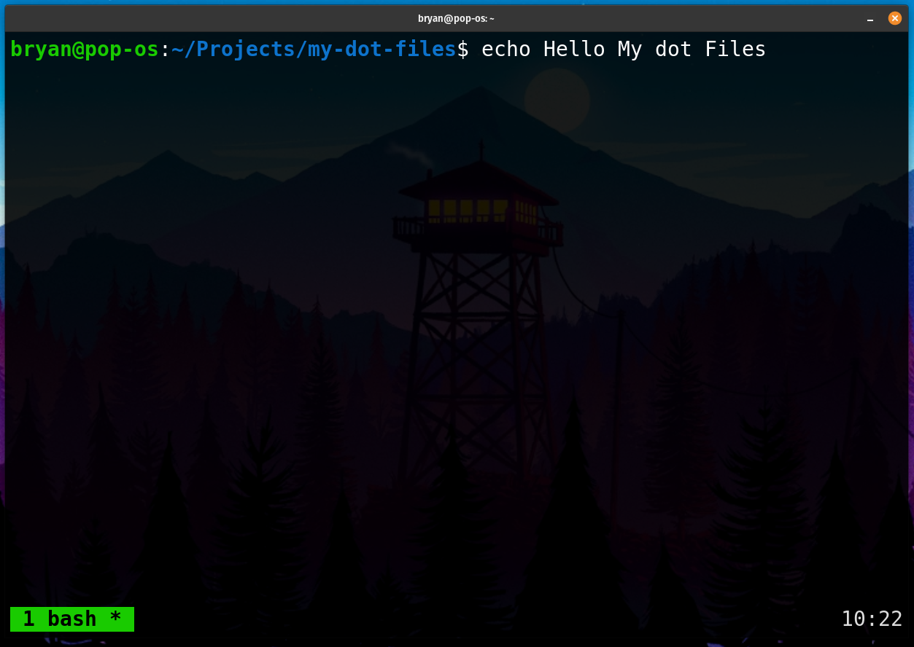

# My Dotfiles 🖥️

A collection of my essential configuration files for bash, kitty, and tmux.



## File Tree Structure 📁

```text
/Projects/my-dot-f/
├── bash/
│   └── .bashrc
├── kitty/
│   └── kitty.conf
└── tmux/
    ├── tmux_colors.sh
    └── .tmux.conf
```

## Installation Guide ⚙️

### Prerequisites
- Backup existing config files:
  ```bash
  mv ~/.bashrc ~/.bashrc.bak
  mv ~/.config/kitty/kitty.conf ~/.config/kitty/kitty.conf.bak
  mv ~/.tmux.conf ~/.tmux.conf.bak
  ```

### 1. Bash Configuration
**File:** `bash/.bashrc`

🔗 Symlink to home directory:
```bash
ln -s $(pwd)/bash/.bashrc ~/.bashrc
```

🔄 Reload configuration:
```bash
source ~/.bashrc
```

### 2. Kitty Terminal Configuration
**File:** `kitty/kitty.conf`

🔗 Create config directory and symlink:
```bash
mkdir -p ~/.config/kitty
ln -s $(pwd)/kitty/kitty.conf ~/.config/kitty/
```

🔄 Restart kitty terminal to apply changes

### 3. Tmux Configuration
**Files:**
- `tmux/.tmux.conf`
- `tmux/tmux_colors.sh`

🔗 Symlink main config:
```bash
ln -s $(pwd)/tmux/.tmux.conf ~/.tmux.conf
```

🔗 Install color script:
```bash
ln -s $(pwd)/tmux/tmux_colors.sh ~/tmux_colors.sh
chmod +x ~/tmux_colors.sh
```

🔄 Reload tmux config:
```bash
tmux source-file ~/.tmux.conf
```

## Features Overview ✨

### Bash
- Custom prompt with git status
- Common aliases (ll, la, etc.)
- History optimizations

### Kitty
- Custom font settings
- Window layout preferences
- Color scheme configurations

### Tmux
- Prefix key set to Ctrl-a
- Mouse mode enabled
- Status bar customization
- Color scheme script for theming
